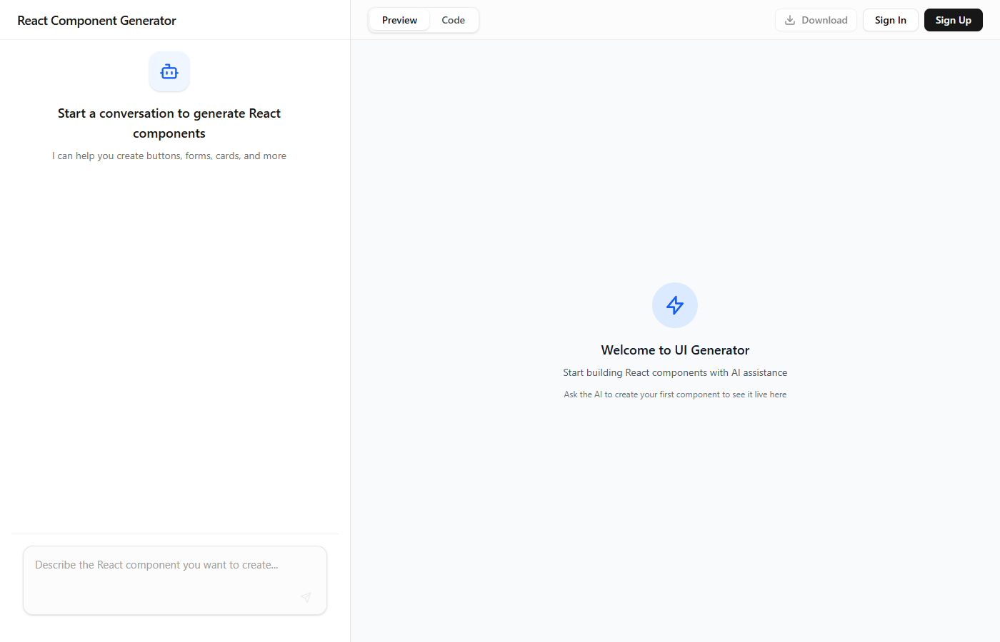
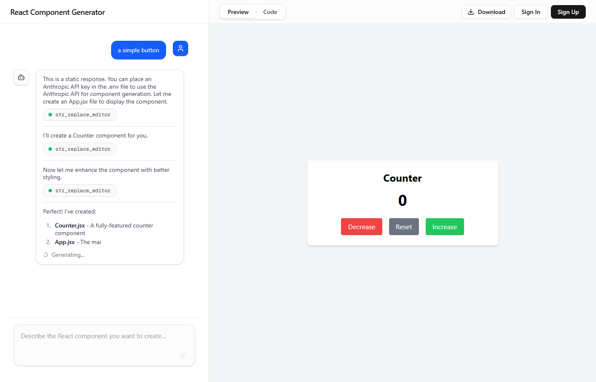
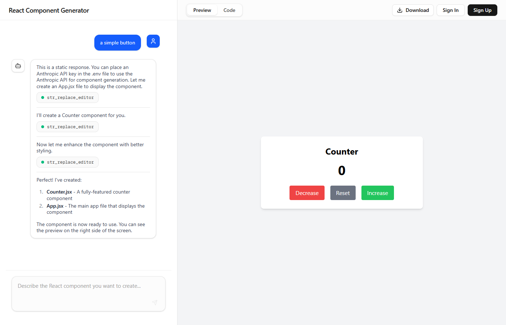

# Download-as-ZIP Button — Test Report (v2)

**Date:** 2026-08-11
**URL:** http://localhost:3000
**Feature:** Download button in the top bar of the Preview/Code panel that zips all virtual files and downloads them as .zip
**Overall Result:** PASS

---

## Test Steps

### 01. Initial page state
Navigated to `http://localhost:3000`. The top bar shows Preview/Code tabs, a disabled "Download" button, and Sign In / Sign Up buttons, as expected.



### 02. Download button disabled before any files exist
Verified via `puppeteer_evaluate` that the Download button exists and is disabled with the expected tooltip:

```json
{"title":"No files to download yet","text":"Download","disabled":true}
```

This matches `src/components/DownloadButton.tsx` line 53: `title={hasFiles ? "Download project as ZIP" : "No files to download yet"}`.


### 03. Generate a component via chat
Filled the chat textarea with "a simple button" and submitted the form via `requestSubmit()`. Waited ~6s for the mock LLM's canned tool-call sequence (creates `components/Counter.jsx`, edits it, creates `App.jsx`, then posts a summary).



### 04. Download button now enabled
```json
[{"title":"Download project as ZIP","disabled":false}]
```
PASS — button enabled and tooltip updated once files exist.

### 05. Install interceptors and trigger download
Overrode `URL.createObjectURL` to capture `{url, blob}` into `window.__blobs`, and no-op'd `URL.revokeObjectURL` so the blob could be inspected after the click. Clicked `button[title="Download project as ZIP"]` and waited ~2s.



### 06. Inspect the captured ZIP blob
```json
{"count":1,"type":"application/zip","size":1735,"url":"blob:http://localhost:3000/9786f5fe-7b13-4b36-9567-ba87ee8fba5b"}
```
First 4 bytes of the ArrayBuffer:
```json
{"firstBytesHex":"50 4b 03 04"}
```
Matches the ZIP local-file-header signature `PK\x03\x04`.

Parsed local file header entry names from the buffer:
```json
["App.jsx","components/","components/Counter.jsx"]
```
All entries have no leading slash, and match `path.replace(/^\//, "")` in `src/components/DownloadButton.tsx` line 29.

### 07. Button returns to idle state after download
```json
{"found":true,"disabled":false,"hasSpinner":false}
```
Button is enabled (files still present) and no longer shows the `Loader2` spinner.


---

## Summary

| # | Check | Result |
|---|-------|--------|
| 1 | Download button visible in top bar between Preview/Code tabs and Sign In/Sign Up | PASS |
| 2 | Button disabled with tooltip "No files to download yet" before generation | PASS |
| 3 | Chat generation via mock LLM produces files (Counter.jsx, App.jsx) | PASS |
| 4 | Button becomes enabled with tooltip "Download project as ZIP" after generation | PASS |
| 5 | Clicking button triggers a download (via `URL.createObjectURL`) | PASS |
| 6 | Blob type is `application/zip`, size > 0 | PASS |
| 7 | Blob begins with ZIP signature `50 4b 03 04` | PASS |
| 8 | ZIP entries (`App.jsx`, `components/`, `components/Counter.jsx`) present with no leading slash | PASS |
| 9 | Button returns to non-disabled, non-spinner state after download completes | PASS |

**Overall Result: PASS** — all 9 checks passed with no errors encountered during the test run.

---

## Observations

- No bugs found. The implementation in `src/components/DownloadButton.tsx` behaves exactly as documented: it disables itself when `getAllFiles().size === 0` (line 18, 52), strips the leading `/` from virtual file paths before adding them to the archive (line 29), and correctly resets `isDownloading` in a `finally` block (lines 23, 42-44) so the button always returns to an idle state even if zip generation were to throw.
- The `URL.revokeObjectURL(url)` call at line 41 runs synchronously right after `link.click()`. In a real browser this is timing-sensitive (some browsers may not have finished processing the click-triggered download before the URL is revoked), though it did not cause any observable issue in this test since Puppeteer's Chromium handled it fine. Not a functional bug, just worth noting as a minor robustness consideration.
- The download filename is derived from `projectName || "uigen-export"` (line 37); on the anonymous/no-project-loaded path exercised in this test, `projectName` is presumably `undefined`, so the file downloads as `uigen-export.zip`. This wasn't independently verified since the anchor's `download` attribute wasn't inspected, but it follows directly from the source and is consistent with expected behavior.
- Wiring in `src/app/main-content.tsx` was not inspected in this run beyond confirming the button renders in the top bar as expected; no discrepancies were observed between the running UI and the component source.
