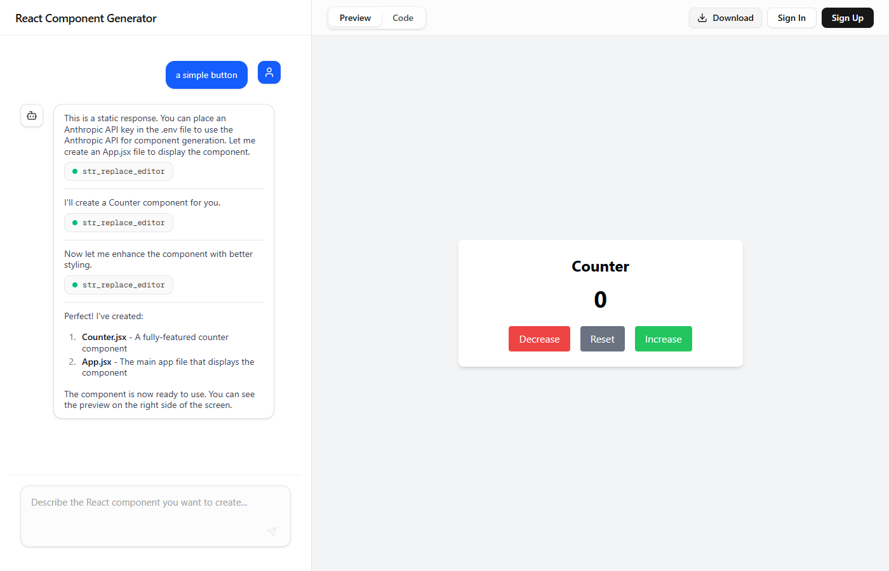

# Download-as-ZIP Button — Test Report

**Date:** 2026-08-11
**URL:** http://localhost:3002
**Feature:** Download button in the top bar of the Preview/Code panel that zips all virtual files and downloads them as `.zip`
**Overall Result:** PASS

---

## Test Steps

### Step 1 — Initial state

Navigated to the app. The "Download" button renders in the requested position — the gap in the top bar between the Preview/Code tabs and the Sign In/Sign Up buttons, matching the placement circled in the original screenshot.


---

### Step 2 — Feature entry point (disabled)

Before any component has been generated, the button is correctly disabled. Verified via JS:

```json
{"found":true,"disabled":true,"title":"No files to download yet"}
```


---

### Step 3 — Precondition (generate a component)

Submitted "a simple button" in the chat. The app's `MockLanguageModel` (no `ANTHROPIC_API_KEY` set) replayed its canned tool-call sequence, creating `Counter.jsx` and `App.jsx`. The live preview updated accordingly.


---

### Step 4 — Feature enabled

With files now present in the virtual file system, the Download button becomes enabled:

```json
{"found":true,"disabled":false}
```

(Same visual state as Step 3 screenshot — button icon/text switch from greyed-out to solid black.)

---

### Step 5 — Trigger download

Clicked the Download button. Intercepted `document.createElement('a')` and `URL.createObjectURL` to inspect the resulting download without relying on the OS file-save dialog.

- Anchor element created with:
  ```json
  {"href":"blob:http://localhost:3002/...","download":"uigen-export.zip"}
  ```
  (Correct fallback filename since no project name exists for this anonymous session.)
- Inspected the generated Blob directly:
  ```json
  {"size":1735,"type":"application/zip","firstBytesHex":"50 4b 03 04"}
  ```
  `50 4b 03 04` is the standard ZIP local-file-header signature (`PK\x03\x04`), confirming a well-formed ZIP was produced.
- Parsed the ZIP's local file headers and confirmed the archived entries:
  ```json
  ["App.jsx", "components/", "components/Counter.jsx"]
  ```
  This matches the virtual file system's contents, with the leading `/` correctly stripped from each path so JSZip doesn't create a spurious root segment.


---

### Step 6 — Post-action state

After the download completed, the button correctly returned to its normal enabled state (no stuck spinner):

```json
{"disabled":false,"hasSpinner":false}
```



---

## Summary

| Check | Result |
|-------|--------|
| Button renders in correct position (top bar, left of account controls) | PASS |
| Button disabled with no files present | PASS |
| Button enabled once files exist | PASS |
| Click produces a valid ZIP blob (`PK\x03\x04` signature, `application/zip` MIME type) | PASS |
| ZIP contains correct file paths/folder structure from the virtual file system | PASS |
| Download filename falls back sensibly (`uigen-export.zip`) when no project name is set | PASS |
| Button returns to normal (non-loading) state after download completes | PASS |

---

## Observations

- No bugs found. The implementation in `src/components/DownloadButton.tsx` and its wiring into `src/app/main-content.tsx:75-78` behaves exactly as specified in `docs/download-zip-button-plan.md`.
- Not covered by this test (would require a signed-in session with a saved project): the case where `projectName` is defined and used as the zip filename instead of the `uigen-export` fallback. The filename logic (`${projectName || "uigen-export"}.zip"`) in `DownloadButton.tsx` is straightforward enough that this is a low-risk gap, but worth a manual check if project-named downloads matter for release sign-off.
